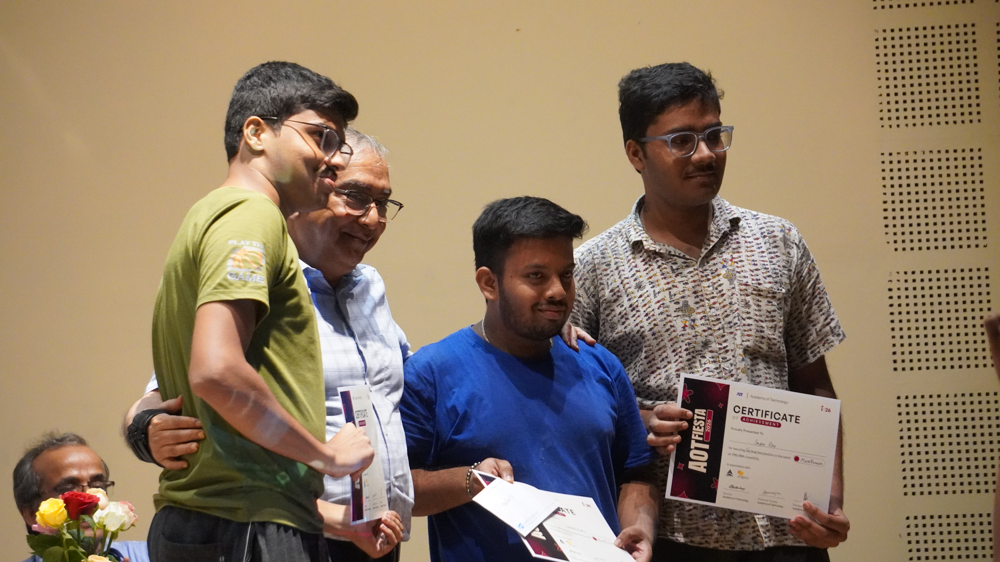
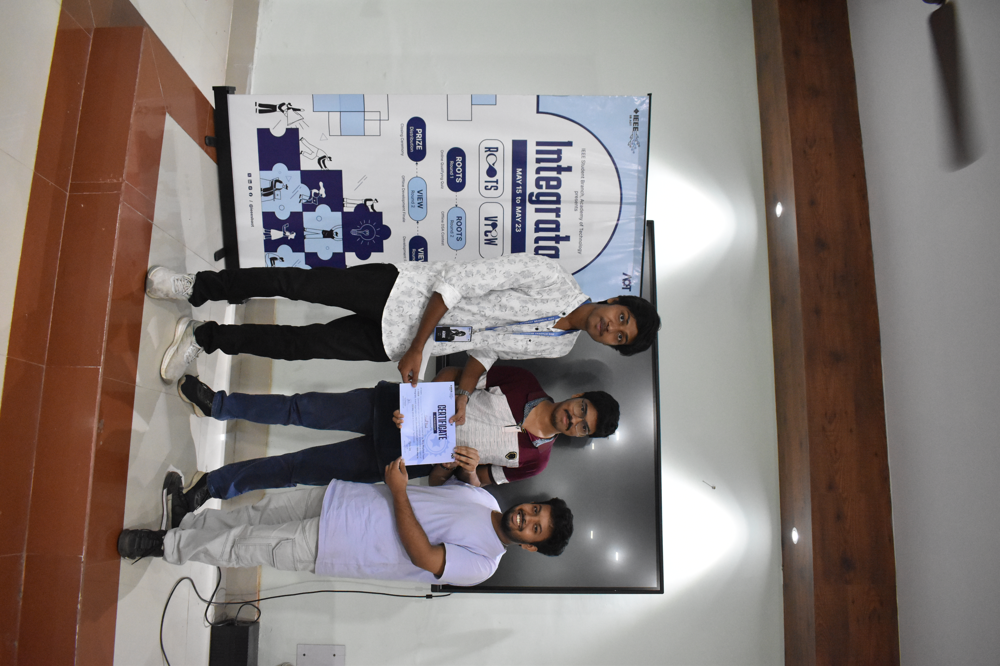

  
  
  

    
    
    
  

  
  

### 🛠️ IoT Developer · Electronics Enthusiast · Smart Systems Builder

---

## ⚡ About Me

---

## 🧰 Tech Stack

**Embedded & Hardware**

**Languages & Backend**

**Data & ML**

**Databases & Cloud**

**Tools & Design**

---

## 📊 GitHub Stats

---

## 🏆 Trophies & Achievements

---

## 🔝 Featured Repos

### My open source projects & active repositories

[View all repositories →](https://github.com/gourab354?tab=repositories)

---

## 🐍 Contribution Snake

<picture>
  <source media="(prefers-color-scheme: dark)" srcset="https://raw.githubusercontent.com/gourab354/gourab354/output/github-snake-dark.svg" />
  <source media="(prefers-color-scheme: light)" srcset="https://raw.githubusercontent.com/gourab354/gourab354/output/github-snake.svg" />
  
</picture>

---

## 🏅 Achievements & Moments

<table>
  <tr>
    <td align="center">  <b>🏆 AOTFIESTA</b></td>
    <td align="center">  <b>🎯 View</b></td>
  </tr>
</table>

---

### 💬 Dev Quote of the Day

*"Hardware talks, software listens — I make them understand each other."*

